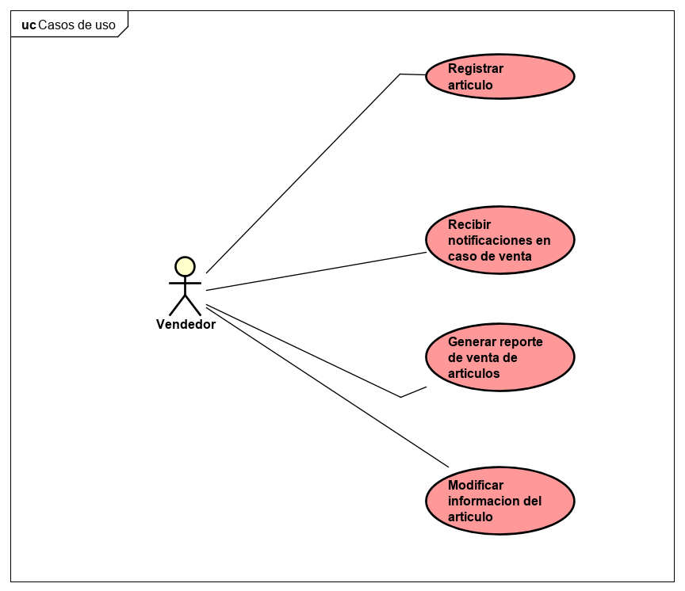

# Escuela Colombiana de Ingeniería Julio Garavito
# Proyecto Arquitectura de Software 2020-2
# Grupo 2
## Integrantes: 
>- Paola Andrea Cuellar Lopez
>- Nicolás Ortega Limas
>- Diego Chinchilla     

## Roles:
|     Nombre    |     Rol         | Trabajo realizado
|:--------------:|:-------------: |:-------------: |
|Paola Andrea Cuellar López |Team Developer    |  Desarrollo de la capa de Front End  |
|Nicolas Ortega Limas |Team Developer   | Front ,requerimiento no funcionales y Diagramas |
|Diego Chinchilla |Team Developer   | Desarrollo de la capa de Back End |
|Ing. Sebastián Henao Pinzón |Product Owner   | Revisor del proyecto  |
# SubastasDINIPA
## Resumen
## Descripción (antecedentes, problema que se resuelve, etc.). 
Esta aplicación tiene como objetivo principal brindar a la comunidad una herramienta fácil y eficiente para la realización de subastas.
Permite a los usuarios publicar e interactuar activamente con las
subastas; registrando ofertas, reacciones y comentarios, además de brindar
la opción de poder visualizar los datos en gráficas, de tal manera que sean mucho más amenos al usuario.

## Construido con

+ [Maven](https://maven.apache.org/) - Manejo de dependencias
+ [Java](https://www.java.com/es/) - Lenguaje usado para el desarrollo
+ [Spring](https://spring.io/) - Framework de desarrollo
+ [Crazy Egg](https://crazyegg.com/) - Testing requerimientos no funcionales
+ [Git](https://git-scm.com/) - Control de versiones
+ [JCache](https://www.baeldung.com/jcache) - Implementación del cache
+ [Postman](https://www.postman.com/) - Pruebas de integración
+ [Newman](https://learning.postman.com/docs/running-collections/using-newman-cli/command-line-integration-with-newman/) - Automatización de pruebas de integración

## Herramientas para seguir el estado del proyecto

## _Analisis estático de codigo_

## _Analisis dinamico de codigo_

## _Despliegue en Heroku_

## _Planeación en JIRA_
[JIRA](https://dinipa.atlassian.net/secure/RapidBoard.jspa?rapidView=1&projectKey=SUB&view=planning.nodetail&issueLimit=100&atlOrigin=eyJpIjoiNWFjOTMyNmE2ZDExNDRjM2FjZGJmZGZmMDJjY2Y0YzEiLCJwIjoiaiJ9)
## _Manual de Usuario_
[Manual](https://drive.google.com/file/d/1vmt2DOWO130cWTj1kx5Do0whaVNj2zT5/view?usp=sharing)

## Diagramas de casos de uso:

## Administrador

## Vendedor

## Comprador

## Historias de usuario

Podrás consultar las historias de usuario en el siguiente [link.](https://dinipa.atlassian.net/secure/RapidBoard.jspa?rapidView=1&projectKey=SUB&selectedIssue=SUB-4)

## Enlace
Podrá acceder a nuestro proyecto en el siguiente [link.](https://subastasdinipa.herokuapp.com)

## Funcionalidades más importantes:
>- Permitir al usuario un inicio de sesión que corresponda con su información.
>- Permitir a los usuarios publicar sus articulos a subastar.
>- Permitir al usuario consultar por productos
>- Permitir a los usuarios comunes registrar productos a subastar y ofrecer por estos.
>- Permitir a los usuarios administradores modificar las subastas.
>- Recibir notificaciones al vender un artículo.
>- Permitir a los usuarios administradores modificar información de otros usuarios.
# Diseño

## Diagrama de Clases

## Diagrama de Clases controllers

## Diagrama de Clases services

## Diagrama de Clases model

## Diagrama de Clases persistence

## Diagrama de Componentes

## Diagrama de Despliegue

## Diagrama de Base de Datos

### Mockups
* Vista de la pagina de inicio 
  
* Vista Informacion general del usuario
  
* Agragar un articulo para subastar
  
* Vista del articulo del dueño
  
* Vista del usuario que participa en la subasta
  
* Vista de las subastas participadas por el usuario
  
  
### Metodología.
En este proyecto pusimos en práctica la utilización de **la metodología Scrum** en la cual el equipo se reúne y planea lo que se realizará en los diferentes Sprint, la herramienta que se utilizo fue **JIRA** la cual nos permite llevar un control de las historias de usuario y repartir las tareas entre los integrantes.

### Atributos No Funcionales
En este proyecto decidimos documentar dos escenarios que muestren nuestra apropiación del requerimiento no funcional. 
Escogimos la **Usabilidad** y la demostraremos por medio del uso de las pruebas A/B y de la herramienta **Crazy Egg** 

### Pruebas A/B

El A/B Testing consiste en desarrollar y lanzar dos o más versiones de un mismo elemento y medir cuál funciona mejor. Es una prueba que nos sirve para optimizar una estrategia de  marketing o para mejorar la usabilidad de una pagina web.

En específico nos centraremos en las KPI generadas en los mapas y en el conversion rate.

## Conversion rate:
Es el porcentaje de usuarios que realizan una acción específica ya sea realizar una compra, una descarga, un registro o una reserva. La tasa de conversión se obtiene como resultado de dividir el número de objetivos conseguidos entre los usuarios únicos que visitan la web.

Los principales estudios sobre la tasa de conversión muestran que la tasa de conversión media es de entre un 1% y un 3%, es decir, de cada 100 personas que entran en una web entre 1 y 3 personas realizan la acción que queremos.

## Funcionamiento
Este método consiste en desarrollar dos versiones de un mismo elemento que vamos a lanzar al mercado (por ejemplo, un botón de  azul y uno amarillo), y luego utilizar las métricas de cada variación para evaluar cuál funciona mejor.

En nuestro caso decidimos usar algunas modificaciones como lo fueron:

* Cambiar palabras, colores, tamaños y ubicación textos.
* Cambiar titulares de la descripción de algunos productos.
* Reducir la extensión de un formulario y tipos de campos.
* Cambiar el layout visual de la página web.
* Cambiar algunas imágenes de productos.

### Crazy Egg
Crazy Egg es una herramienta de usabilidad y optimización web que monitoriza la actividad de los usuarios en una página web. Permite extraer información muy útil de cara a ver cómo se navega la página, ya que muestra, por ejemplo, en qué secciones de la web se detienen los usuarios, hasta qué punto hacen scroll, dónde hacen clic, etc. Con estos datos se pueden tomar decisiones cruciales tanto de diseño como de usabilidad.

* Generamos Scroll maps que nos muestran el contenido más visualizado de nuestro API:

* Generamos Heat maps que nos muestran el contenido más clickeado junto con sus elementos relacionados de nuestro API:

* Generamos Confetti maps que básicamente es un heat map ampliado que muestra las fuentes de referencia que generan la mayor cantidad de clics y la tendencia de estos en el API:

* Finalmente generamos estadísticas por cada elemento disponible para saber que elementos eran los que estaban recibiendo más interacciones:

### Prueba antes y despues de cache

Implementamos una de las soluciones de cache soportadas por Spring llamada JCache. Esta implementación nos redujo los timepos de carga medidos por Crazy Egg como se muestra a continuación:
* Antes

* Después

  

## Implementacion del real time

Implementamos el real time en nuestro API mediante la oferta de la subasta:

## Escenarios de calidad
* Realizar una puja por un producto
* En primer lugar en Crazy Egg definimos 3 Variantes para este caso de uso.
* Variante de Control 

* Variante uno

* Variante dos

* Resultados

        
* Publicar un articulo
* En primer lugar en Crazy Egg definimos 2 Variantes para este caso de uso.
* Variante de Control 

* Variante uno

* Resultados

Estos resultados demuestran que las modificaciones realizadas a el Front por ahora han mejorado la experiencia de uso.

